<div align="center">

# VN Maker

**한국어 비주얼 노벨을 쓰고, 연출하고, 그대로 세상에 내놓는 제작 도구**

원고 · 연출 · 분기 · 원화 · 음악을 한 화면에서 다루고, 완성한 작품을 웹 게임 · losia.online · Ren'Py 네이티브 빌드로 내보냅니다.

[](LICENSE)
[](.node-version)
[](tsconfig.base.json)
[](packages/app)
[](packages/desktop)
[](#개발)
[](tests/e2e)
[](docs/integration/losia-store.md)

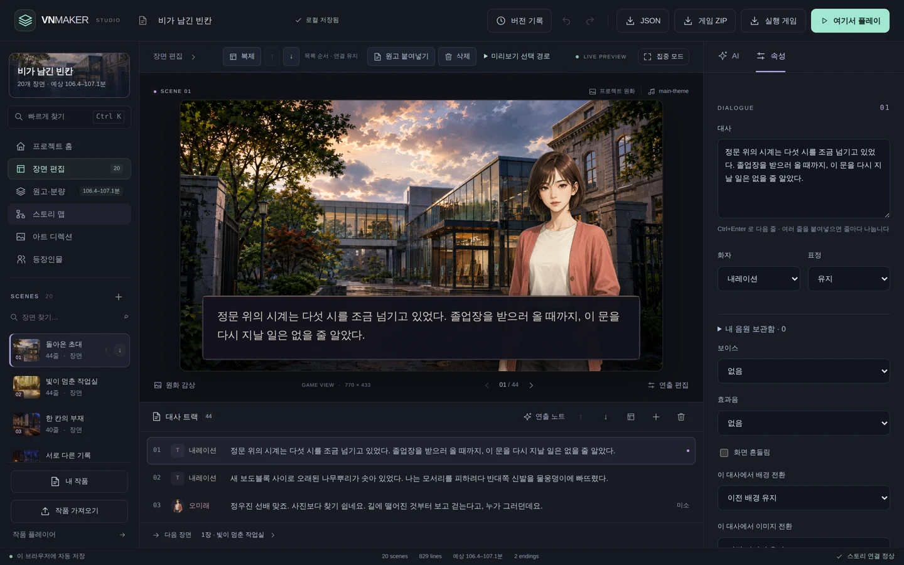

</div>

---

## 이게 뭔가요

- **쓰면서 바로 봅니다.** 왼쪽에서 대사를 고치면 가운데 미리보기가 즉시 그 장면을 그립니다. 화자·표정·배우 배치·카메라·배경·CG·음악·효과음을 대사 단위로 지정합니다.
- **분기를 다룹니다.** 상태 변수(켜짐/꺼짐·숫자·문자)를 만들고 선택지가 값을 바꾸며, 대사와 선택지에 표시 조건을 겁니다. 호감도 누적 같은 연산도 됩니다.
- **완성하면 나갑니다.** 게임 ZIP 하나로 정적 웹 호스팅에 올리거나, **losia.online에 바로 게시**하거나, Windows에서 Ren'Py SDK로 실행 파일을 만듭니다.
- **에셋은 두 갈래로 옵니다.** 내장 카탈로그 46종은 오프라인에서도 바로 설치되고, **losia 스토어의 수백 종**(무대·인물·소리)은 편집기 안에서 검색해 그대로 가져옵니다. 내가 그린 원화·음원도 losia에 올려 공개할 수 있습니다.
- **계정 없이 돌아갑니다.** 플레이와 편집에 로그인이나 외부 API가 필요 없습니다. AI 기능은 전부 선택 사항입니다.

기본 작품으로 장편 비주얼 노벨 **〈비가 남긴 빈칸〉**이 들어 있습니다. 20장면 · 829행 · 8경로 · 2엔딩 · 원화 35장, 한 경로당 약 106분 분량입니다.

> **상태**: 활발히 개발 중입니다. 핵심 제작 루프와 배포는 동작하지만 일반 사용자 대상 출시 준비는 끝나지 않았습니다. 알려진 제약은 [사용 설명서](docs/guide.md)와 [구현 상태](docs/production/status.md)에 정리했습니다.

---

## losia.online — 재료를 가져오고, 완성작을 올립니다

[losia.online](https://losia.online)은 VN Maker로 만든 작품을 바로 플레이하는 에셋·호스팅 서비스입니다. 편집기가 스토어와 게시를 한 화면에서 처리합니다.

<table>
<tr>
<td width="50%">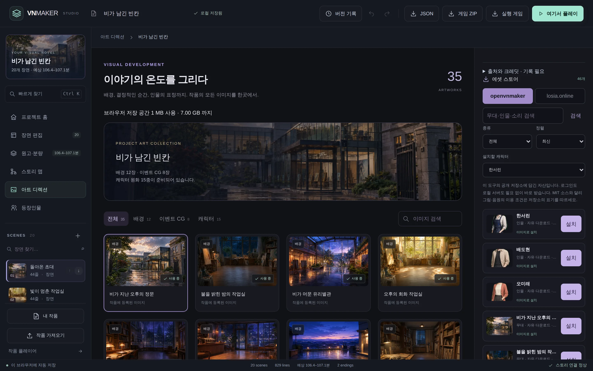</td>
<td width="50%">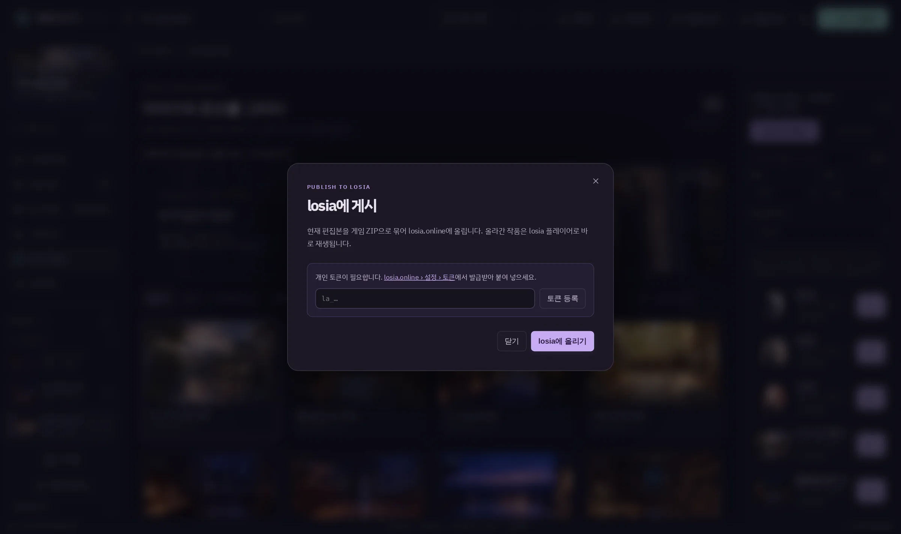</td>
</tr>
</table>

- **가져오기** — 아트 라이브러리·음원 보관함 안의 스토어 패널에서 losia 카탈로그를 검색해 설치합니다. 인물 패키지를 설치하면 표정(`expression:*`)이 캐릭터 표정 키로 자동 연결되고, 단색 배경 제거(chromaKey)도 함께 적용됩니다. 라이선스는 게이트웨이가 강제해 `embedded` 등급은 원본 다운로드를 막습니다.
- **올리기 — 작품** — 상단 바의 **losia에 게시**가 현재 편집본을 게임 ZIP으로 묶어 업로드하고 `/play/<slug>` 주소를 돌려줍니다. `la_…` 개인 토큰은 로컬 게이트웨이에만 저장됩니다.
- **올리기 — 에셋** — 내 배경 원화는 `stage`, 표정 세트는 `base + expression:*` 인물 패키지, 음원은 `sound`로 losia에 올려 다른 제작자가 내려받게 할 수 있습니다.
- **호스팅 실행** — losia의 `/make`는 이 스튜디오를 그대로 호스팅합니다. 호스트가 `/.well-known/openvnmaker.json` 능력 기술서를 내놓으면 게이트웨이가 없는 배포에서는 게이트웨이 전용 버튼(AI·네이티브·그래프 컴파일)이 자동으로 숨고, 저장은 브라우저로만 동작합니다.

---

## 그래프 프로젝트 — 노드로 쓰고 컴파일해 플레이

게이트웨이의 `story` 프로젝트는 노드·엣지 그래프로 이야기를 설계하는 두 번째 저작 경로입니다.

- 노드(장면·선택·조건·변수)를 엣지로 연결하면 컴파일러가 `VnScript`를 만듭니다 — `/api/project/script`.
- 조건 경로, 조건 선택지, `choice.set` 상태 변경, 씬 진입 `set`을 지원합니다.
- `story/characters.json`과 `vnmaker.json`이 컴파일에 반영돼 한글 표시명·부제·인물 스프라이트를 붙일 수 있습니다.
- 상단 바의 **그래프 미리보기**가 컴파일 결과를 처음부터 플레이어로 엽니다. 배경·CG·스프라이트에 `/assets/user/…` 주소를 쓰면 설치한 losia 자산이 그대로 나옵니다.

---

## 화면

### 장면 편집 — 원고와 연출을 같이


대사 트랙에서 줄을 고르면 오른쪽 속성 패널에서 화자·표정·보이스·효과음·배경 전환을 지정합니다. 줄 이동과 복제, 여러 줄 붙여넣기 분할, `Ctrl+Enter` 로 다음 줄 추가를 지원합니다.

### 프로젝트 홈 — 분량과 상태를 한눈에

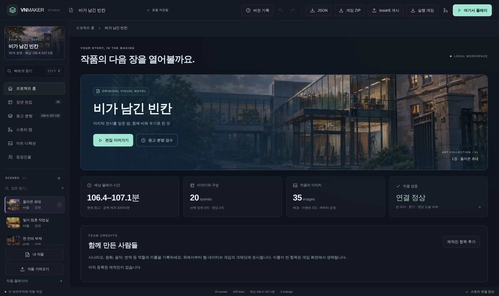

예상 플레이 시간, 장면·엔딩 수, 등록한 이미지, 연결 검증 결과를 함께 봅니다.

### 스토리 맵 — 분기 구조

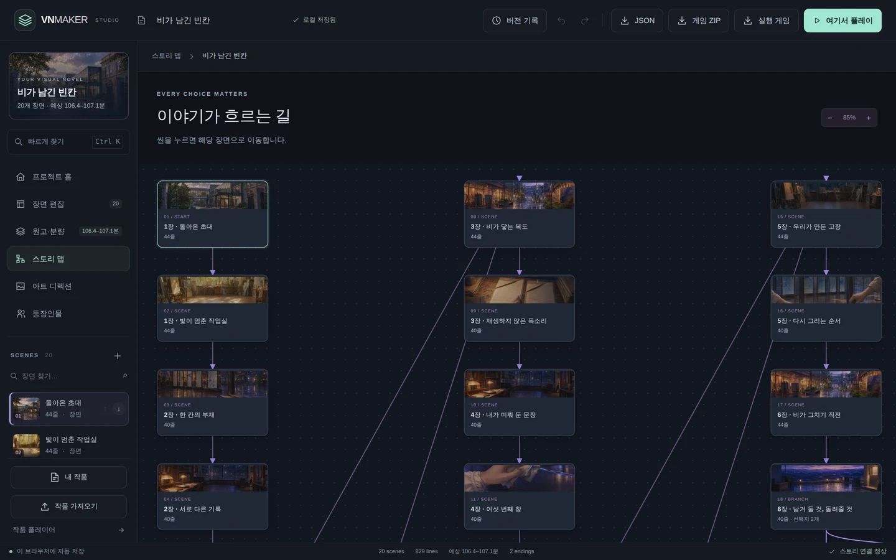

선택지가 어디로 이어지고 어느 엔딩으로 닫히는지 확인합니다.

### 원고·분량 — 90분 기준과 AI 스토리 점검

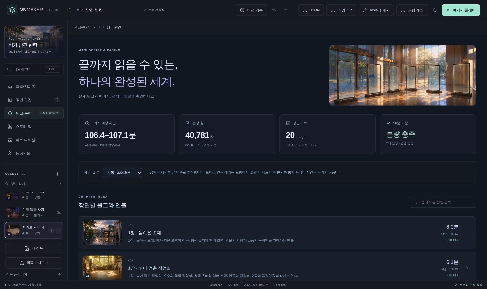

읽기 속도별 분량을 계산하고, 선택하면 **AI 스토리 점검**이 연속성·개연성·인물 목소리·복선·페이싱·분기 균형을 읽고 지적합니다. 구조 검사가 놓치는 서사 문제를 봅니다.

### 아트 디렉션 — 원화 보관함

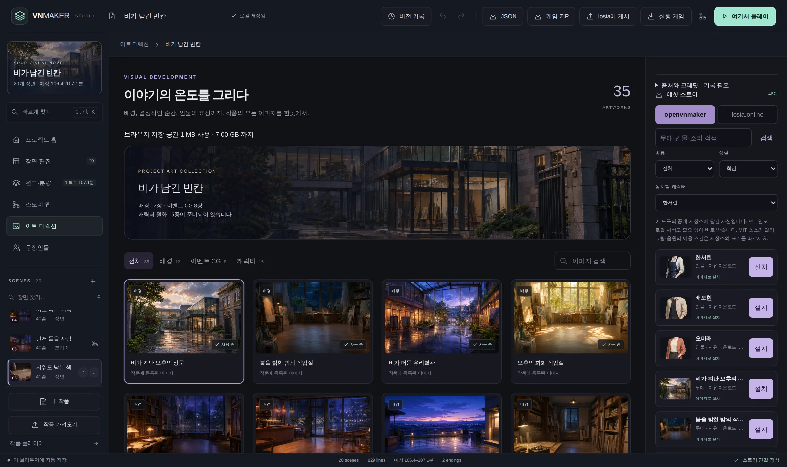

배경·이벤트 CG·캐릭터 표정을 관리하고 장면에 적용합니다. 이미지 생성은 **Codex(로컬 ChatGPT)** 와 **Agy(Google Gemini)** 중에서 고를 수 있습니다.

### 음원 보관함 — 음악·효과음·보이스와 소리 스토어

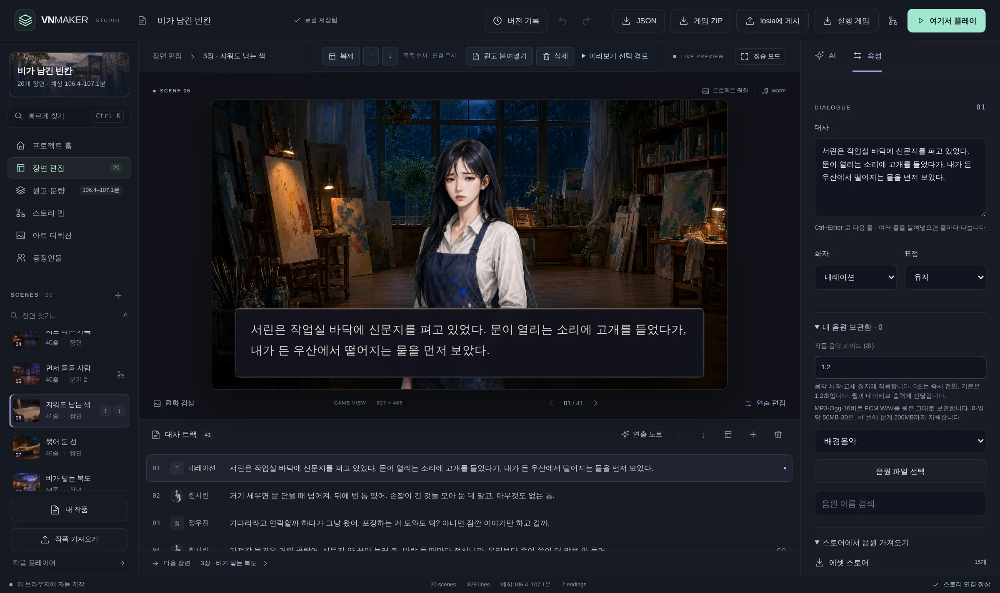

작품 음악 페이드, 줄 단위 효과음·보이스를 관리하고, 스토어에서 BGM·SFX를 바로 가져와 씬에 연결합니다.

### 플레이어

<table>
<tr>
<td width="33%">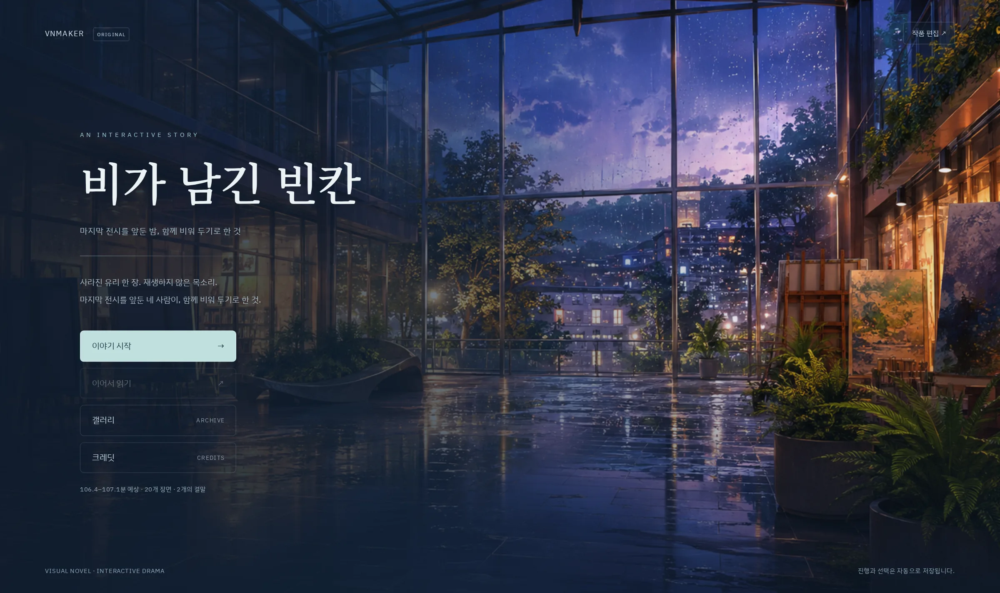</td>
<td width="33%">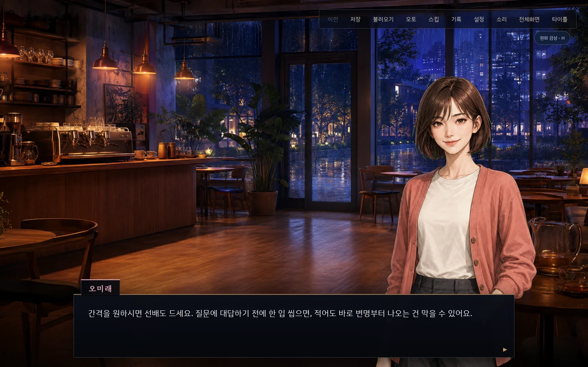</td>
<td width="33%">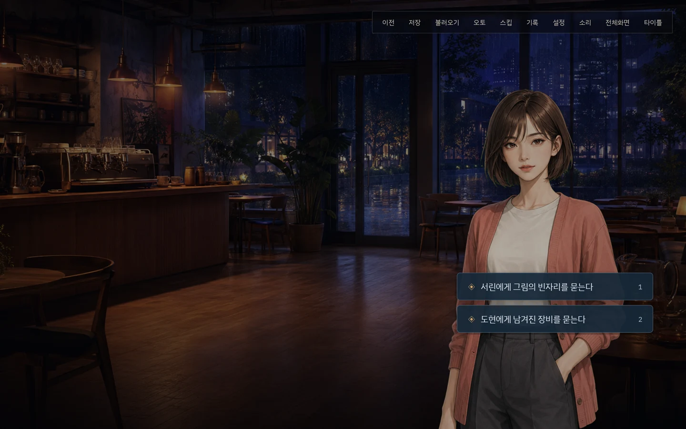</td>
</tr>
</table>

저장 슬롯 6개와 자동 저장, 백로그, 롤백, 오토·스킵, 원화 감상, 갤러리, 전체화면을 갖춘 플레이어입니다. 편집기에서 **여기서 플레이**로 지금 쓰던 위치부터 바로 확인할 수 있습니다.

---

## 빠르게 시작하기

Node **24.20.0**, pnpm **11.24.0** 이 필요합니다.

```sh
pnpm install --frozen-lockfile
pnpm dev
```

- 편집기 <http://127.0.0.1:5173/studio.html>
- 플레이어 <http://127.0.0.1:5173/>

### 데스크톱 앱으로 실행

```sh
pnpm desktop:dev      # 개발 모드 (핫 리로드)
pnpm desktop:dist     # Windows · macOS 설치본 생성
```

Electron 셸은 로컬 서버를 띄우고 그 위에 창을 올립니다. `file://` 로는 서비스 워커가 등록되지 않아 사용자 원화 보관함이 동작하지 않기 때문입니다. 자세한 구조와 코드 서명 안내는 [데스크톱 문서](packages/desktop/README.md)에 있습니다.

---

## 배포

| 방식 | 결과물 | 필요한 것 |
|---|---|---|
| **losia 게시** | `losia.online/play/<slug>` 에서 바로 플레이 | `la_…` 개인 토큰 |
| **게임 ZIP** | 독립 실행 웹 게임 (플레이어 + 원화 + 음악) | 정적 HTTP 서버 |
| **Ren'Py 네이티브** | Windows 실행 파일 | Windows + Ren'Py 8.5.3 SDK |
| **작품 JSON** | 원고만 백업·이관 | 없음 |

게임 ZIP은 로그인도 API도 필요 없이 돌아갑니다. 압축을 푼 폴더를 사이트 루트로 서빙하세요.

---

## 기술 구조

```
packages/
  app        React 편집기 + 플레이어 + 순수 리듀서 엔진
  content    원고 스키마 · 파서 · 장면 연결 검사
  ir         노드 기반 이야기 IR 과 컴파일러
  gateway    로컬 AI 게이트웨이 + losia 프록시 (Hono) — 선택 기능
  desktop    Electron 셸 — 정적 파일과 /api 를 한 오리진으로
```

- **엔진이 순수 함수**라 재현과 테스트가 쉽습니다. 없는 장면이나 잘못된 인덱스는 예외 대신 복구 가능한 오류 상태로 남습니다.
- **원고는 하나의 JSON**입니다. 편집기, 플레이어, 게임 ZIP, Ren'Py 출력, 그래프 컴파일 결과가 모두 같은 스키마를 읽습니다.
- **AI 는 전부 선택 사항**입니다. 끄면 편집기와 플레이어는 네트워크 없이 완전히 동작합니다.
- **자동 저장은 이중입니다.** 매 편집이 디바운스·직렬화돼 로컬 스토리지와 작품 보관함(IndexedDB)에 나눠 쌓이고, 손상·충돌은 복구 흐름으로 되돌립니다.

---

## 개발

```sh
pnpm typecheck        # 전 패키지 타입 검사
pnpm test             # 단위 테스트 435개
pnpm e2e              # Playwright E2E
pnpm build            # 프로덕션 빌드
pnpm catalog          # 에셋 카탈로그 다시 생성
```

| 패키지 | 단위 테스트 |
|---|---|
| app | 256 |
| gateway | 120 |
| ir | 30 |
| content | 16 |
| desktop | 13 |

기여 방법과 검증 범위는 [CONTRIBUTING.md](CONTRIBUTING.md) 에 있습니다.

---

## 문서

- [사용 설명서](docs/guide.md) — 편집·저장·복구·배포의 자세한 동작
- [데스크톱 앱](packages/desktop/README.md) — Electron 구조와 코드 서명
- [구현 상태](docs/production/status.md) — 검증 증거와 남은 출시 요건
- [저장소 에셋 스토어](docs/integration/repo-assets.md) — 편집기에서 바로 설치하는 자산 46종
- [losia 스토어 연동](docs/integration/losia-store.md) — 외부 스토어 프록시·게시 경로

---

## 라이선스

애플리케이션과 도구 소스는 [MIT](LICENSE) 입니다.

의존성과 SDK 는 각자의 라이선스를 따르며, 게임 ZIP 에는 포함된 코드의 고지를 동봉합니다. **이 라이선스가 샘플 이미지·음악 등 미디어의 이용 조건까지 바꾸지는 않습니다.** 샘플 미디어의 출처와 이용 조건 정리는 출시 준비 항목으로 남아 있습니다.
